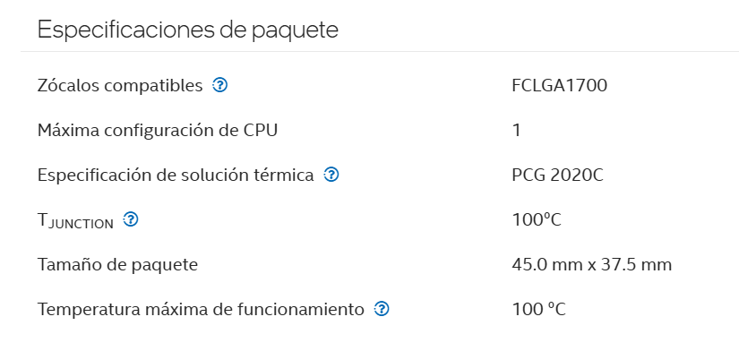
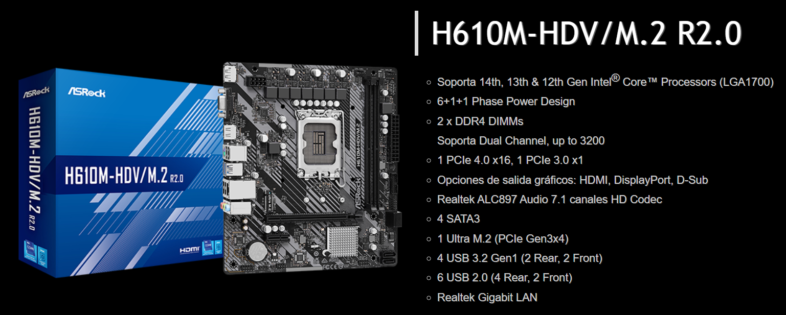
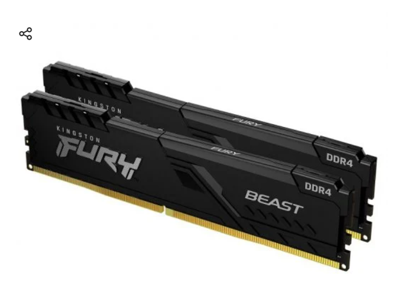
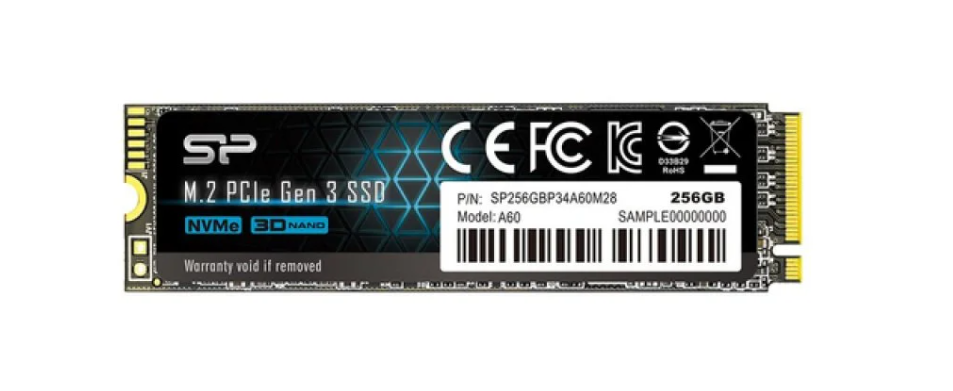
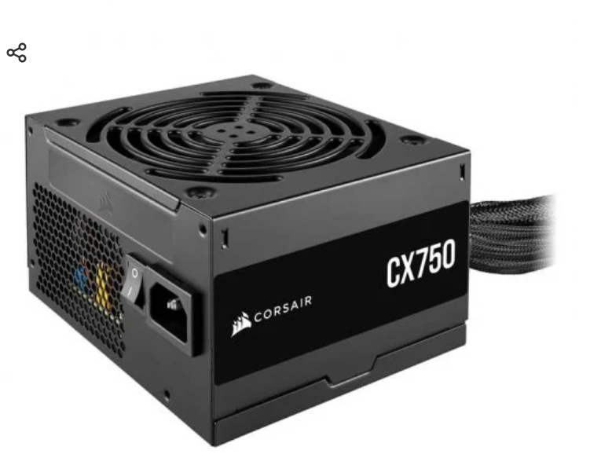
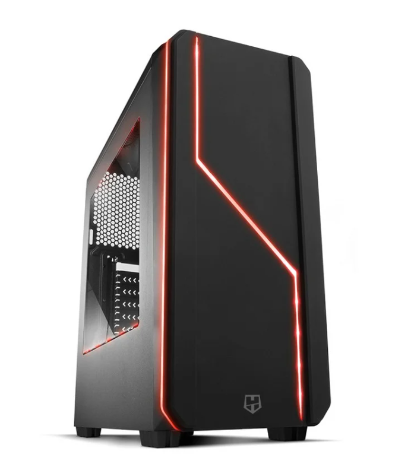

# ENTREGA ÚNICA — Reto 03 (UT3)

> Copia y pega aquí TODO lo necesario para exportar a PDF.

## 1) Portada

# Portada

- **Módulo:** Fundamentos de Hardware (FHW)
- **Unidad:** UT3
- **Reto:** 03 — PC de oficina low-cost + Mini PC
- **Alumno/a:** Alfonso Giménez Martínez
- **Curso/Grupo:** 1º ASIR
- **Fecha:** 17/02/2026

## 2) Opción A — PC por piezas (PASO 1–7)

# Opción A — PC de oficina por piezas (PASO 1–7)

> Rellena cada paso usando la **plantilla**. Mantén el objetivo: **oficina**, precio ajustado y componentes razonables.

## PASO 1 — CPU con gráficos integrados

**Componente elegido:**

- **Marca y modelo:** Intel Core i3-14100
- **Precio (€):** 89.99
- **URL tienda:** https://www.pccomponentes.com/intel-core-i3-14100f-35-47ghz-box?s_kwcid=AL!14405!3!!!!x!!&gad_source=1&gad_campaignid=22157318807&gclid=CjwKCAiAwNDMBhBfEiwAd7ti1EfedmOUrR0GZ7o9KX_Gtz4OCSM1ywHikWvJA9hpBQ66qpsw5DSinhoCeK8QAvD_BwE

**Ficha técnica oficial (obligatorio):**

- URL oficial (fabricante/estándar): https://www.intel.la/content/www/xl/es/products/sku/236774/intel-core-i3-processor-14100-12m-cache-up-to-4-70-ghz/specifications.html

**Características principales (resumen):**

- Nucleos: 4
- Hilos: 8
- temperatura maxima: 100 grados
- Frecuencia: 3,5 Ghz - 4,7Ghz
- Potencia base: 60 W

**Justificación (oficina):**

- Para un ordenador de oficina no es necesario tarjeta dedicada y más teniendo en cuenta que van a ser tareas tipo ofimatica, este procesador lleva una tarjeta grafica integrada (**UHD Graphics 730**), aunque sea de la 14 generación y se caliente un poco más que otros procesadores, creo que es la mejor opcion, porque no va a haber problemas con programas ofimaticos y gracias a ese fallo de la temperatura el precio es más barato.
- Adem,as se pueden ajustar para modificar los nucleos y forzar que no trabaje a tanta frecuencia para no tener temperaturas tan altas.

**Compatibilidad (obligatorio, con enlaces):**

- Compatibilidad clave 1: socket soportado ( LGA1700 )

  - Evidencia (URL): https://www.intel.la/content/www/xl/es/products/sku/236774/intel-core-i3-processor-14100-12m-cache-up-to-4-70-ghz/specifications.html

**Captura (opcional si tu profe lo exige):**

- Inserta imagen con ruta relativa desde `assets/img/`:
  - `assets/img/`:

## PASO 2 — Placa base compatible

**Componente elegido:**

- **Marca y modelo:** ASRock H610M-HVS
- **Precio (€):** 67.61
- **URL tienda:** https://www.pccomponentes.com/asrock-h610m-hvs-m2-r20?s_kwcid=AL!14405!3!!!!x!!&gad_source=1&gad_campaignid=22157318807&gclid=CjwKCAiAwNDMBhBfEiwAd7ti1NOrIapzbvveJL2FOld2Yq7yXB83N2ynIT64TJameGn1Yxis-t4pexoCVKIQAvD_BwE

**Ficha técnica oficial (obligatorio):**

- URL oficial (fabricante/estándar): https://www.asrock.com/MB/Intel/H610M-HVS/index.la.aspASRoc

**Características principales (resumen):**

- Micro ATX
- Soporta 14, 13 y 12 generacion de intel core
- Tiene dos ranuras que soportan ram ddr4 (dual channel)
- 1 PCIe 4.0 x16 (tarjeta gráfica) y 1 PCIe 3.0 x1
- Cuenta con HDMI
- Puertos: 2 SATA3 / 3 USB 3.2 Gen1 (velocidad de sobra para ordenador de oficina)
- Obviamente también cuenta con puerto rj45

**Justificación (oficina):**

- He escogido esta placa base, porque es económica, tiene sl socket y chipset compatible y además, tiene las ranuras de ram que soportan ddr4 (dual channel) y puertos SATA, una ranura M.2 (lo que hace que tengamos mas velocidad de una forma económica por el precio que tiene esta placa base)

**Compatibilidad (obligatorio, con enlaces):**

- Compatibilidad clave 1: el chipset soporta la 14, 13 y 12 generacion de intel core

  - Evidencia (URL): https://www.asrock.com/MB/Intel/H610M-HDVM.2%20R2.0/index.la.asp

**Captura (opcional si tu profe lo exige):**

- Inserta imagen con ruta relativa desde `assets/img/`:

## PASO 3 — Memoria RAM (mínimo 8 GB)

**Componente elegido:**

- **Marca y modelo:** Kingston 16 GB (2x8 GB) DDR4-3200
- **Precio (€):** 164.95
- **URL tienda:** https://www.pccomponentes.com/kingston-fury-beast-ddr4-3200-mhz-16gb-2x8gb-cl16?s_kwcid=AL!14405!3!!!!x!!&gad_source=1&gad_campaignid=22732311568&gclid=CjwKCAiAwNDMBhBfEiwAd7ti1G5Z49KzG-dIKlG0cd6DEG3tQwzvIYntNq4kLMwoiAEnLNVJE84PuhoCiTwQAvD_BwE

**Ficha técnica oficial (obligatorio):**

- URL oficial (fabricante/estándar): https://www.kingston.com/en/memory/search/discontinuedmodels?partId=KVR26N19S8L%2F8

**Características principales (resumen):**

- DDR4 porque para tareas ofimáticas es potencia de sobra y es más económica. Además de que la placa base escogida no sporta ddr5.
- soporta velocidades de hasta 3.200 Mhz con perfiles XMP

**Justificación (oficina):**

- Para tareas ofimaticas de oficina es la mejor copción y la más económica ddr4 (igualmente con el precio de la RAM actualemnte podría ser más económico, pero hay demasiada demanda)

**Compatibilidad (obligatorio, con enlaces):**

- Compatibilidad clave 1 la placa base es compatible con ddr4 y tiene las dos ranuras para conseguir el dual channel.

  - Evidencia (URL): https://www.asrock.com/MB/Intel/H610M-HDVM.2%20R2.0/index.la.asp

**Captura (opcional si tu profe lo exige):**

- Inserta imagen con ruta relativa desde `assets/img/`:
  - 

## PASO 4 — Almacenamiento (SSD)

**Componente elegido:**

- **Marca y modelo:** SanDisk SSD PLUS M.2 NVMe PCIe Gen 3.0 - 250 GB
- **Precio (€):** 60.98
- **URL tienda:** https://www.pccomponentes.com/silicon-power-p34a60-256gb-ssd-m2-pcie-gen3x4?s_kwcid=AL!14405!3!!!!x!!&gad_source=1&gad_campaignid=21438429839&gclid=CjwKCAiAwNDMBhBfEiwAd7ti1Fp9yPSHWHYYawvkSXlmv1wF6Qj0X9QD0JaKTwrYCTUdoxTEOY9qFRoC3tgQAvD_BwE

**Ficha técnica oficial (obligatorio):**

- URL oficial (fabricante/estándar): https://www.sandisk.com/es-la/products/ssd/internal-ssd/sandisk-ssd-plus-m2-nvme?sku=SDSSDA3N-250G-G26

**Características principales (resumen):**

- Velocidad de lectura: 2200 MB/s
- Velocidad de escritura: 1600 MB/s
- Versión NVMe: 1.3

**Justificación (oficina):**

- He escogido este disco duro M.2 ya que la placa base tiene una ranura específica para ello y además, hace mucho menos ruido que un SATA, es más ligro, tiene velocidades más altas y es económico.

**Compatibilidad (obligatorio, con enlaces):**

- Compatibilidad clave 1: La placa base tiene una ranura M.2

  - Evidencia (URL): https://www.asrock.com/MB/Intel/H610M-HVS/index.la.aspASRoc

**Captura (opcional si tu profe lo exige):**

- Inserta imagen con ruta relativa desde `assets/img/`:
  - `assets/img/`:

## PASO 5 — Fuente (PSU)

**Componente elegido:**

- **Marca y modelo:** Corsair CX750 750 W 80 Plus Bronze
- **Precio (€):** 64.95
- **URL tienda:** https://www.pccomponentes.com/corsair-cx750-750-w-80-plus-bronze?s_kwcid=AL!14405!3!!!!x!!&gad_source=1&gad_campaignid=22732311568&gclid=CjwKCAiAwNDMBhBfEiwAd7ti1FNcKxBaT139VsB3GeFKnzt82_0de2JlABCmO1tgXxyIguyGAP4gPRoC_9UQAvD_BwE

**Ficha técnica oficial (obligatorio):**

- URL oficial (fabricante/estándar): https://www.corsair.com/ww/es/p/psu/cp-9020277-na/cx-series-cx550-550-watt-80-plus-bronze-atx-power-supply-cp-9020277-na?srsltid=AfmBOopmbKvRqkRTTB5SM9L2CqIMYBVh-hIlqbeSGRc-ST82yk9LV2mC

**Características principales (resumen):**

- Potencia total: 550 W (potencia para rendir lo suficiente para que no haya nignun fallo)
- No modular
- Certificación: 80 PLUS Bronze
- Fuente ATX (compatible con chasis)

**Justificación (oficina):**

- Es la mejor opción compatible con el chasis, tiene potencia de sobra para alimentar a todos los componentes del sistema, es económica y silenciosa.

**Compatibilidad (obligatorio, con enlaces):**

- Compatibilidad clave 1: ATX lo que es compatible con el chasis

  - Evidencia (URL): https://www.pccomponentes.com/corsair-cx750-750-w-80-plus-bronze?s_kwcid=AL!14405!3!!!!x!!&gad_source=1&gad_campaignid=22732311568&gclid=CjwKCAiAwNDMBhBfEiwAd7ti1FNcKxBaT139VsB3GeFKnzt82_0de2JlABCmO1tgXxyIguyGAP4gPRoC_9UQAvD_BwE

**Captura (opcional si tu profe lo exige):**

- Inserta imagen con ruta relativa desde assets/img/:

## PASO 6 — Chasis

**Componente elegido:**

- **Marca y modelo:** Nox Hummer MC USB 3.0 Negra
- **Precio (€):** 44.99
- **URL tienda:** https://www.pccomponentes.com/nox-hummer-mc-usb-30-negra?srsltid=AfmBOoo90xkzr4Qj1KZ4Jyl8CFdblg1I29gitrwqR6GWxtIfsVaMgxhY

**Ficha técnica oficial (obligatorio):**

- URL oficial (fabricante/estándar): https://www.nox-xtreme.com/cajas/hummer-mc-pro-black-edition

**Características principales (resumen):**

- Compatible con placa base y fuente de alimentacion escogida
- Buena ventilación para los componentes

**Justificación (oficina):**

- Es sencilla y elegante, no ocupa tanto espacio con una torre normal, facil de transportar y compatible con los componentes escogidos ( habria escogido una torre más pequeña perola comodiad y la reducción de espacio hace que el precio sea bastante más caro, por lo que, bajo mi putno de vista esta es mejor opcion.

**Compatibilidad (obligatorio, con enlaces):**

- Compatibilidad clave 1: con fuente de alimentacion
  - Evidencia (URL): https://www.pccomponentes.com/corsair-cx750-750-w-80-plus-bronze?s_kwcid=AL!14405!3!!!!x!!&gad_source=1&gad_campaignid=22732311568&gclid=CjwKCAiAwNDMBhBfEiwAd7ti1FNcKxBaT139VsB3GeFKnzt82_0de2JlABCmO1tgXxyIguyGAP4gPRoC_9UQAvD_BwE
- Compatibilidad clave 2: con placa base
  - Evidencia (URL): https://www.asrock.com/MB/Intel/H610M-HDVM.2%20R2.0/index.la.asp

**Captura (opcional si tu profe lo exige):**

- Inserta imagen con ruta relativa desde `assets/img/`:

## PASO 7 — Presupuesto final

- Suma total de la Opción A (por piezas).
- Justifica si priorizas precio, consumo o posibilidad de ampliación.
- Incluye una mini tabla resumen.

Plantilla sugerida:

| Componente | Modelo                                          | Precio (€) | URL tienda                                                                                                                                                                                                                                          |
| ------------ | ------------------------------------------------- | ------------: | ----------------------------------------------------------------------------------------------------------------------------------------------------------------------------------------------------------------------------------------------------- |
| CPU        | Intel Core i3-14100                             |       89.99 | https://www.pccomponentes.com/intel-core-i3-14100f-35-47ghz-box?s_kwcid=AL!14405!3!!!!x!!&gad_source=1&gad_campaignid=22157318807&gclid=CjwKCAiAwNDMBhBfEiwAd7ti1EfedmOUrR0GZ7o9KX_Gtz4OCSM1ywHikWvJA9hpBQ66qpsw5DSinhoCeK8QAvD_BwE                 |
| Placa base | ASRock H610M-HVS                                |       67.61 | https://www.pccomponentes.com/asrock-h610m-hvs-m2-r20?s_kwcid=AL!14405!3!!!!x!!&gad_source=1&gad_campaignid=22157318807&gclid=CjwKCAiAwNDMBhBfEiwAd7ti1NOrIapzbvveJL2FOld2Yq7yXB83N2ynIT64TJameGn1Yxis-t4pexoCVKIQAvD_BwE                           |
| RAM        | Kingston 16 GB (2x8 GB) DDR4-3200               |      164.95 | https://www.pccomponentes.com/kingston-fury-beast-ddr4-3200-mhz-16gb-2x8gb-cl16?s_kwcid=AL!14405!3!!!!x!!&gad_source=1&gad_campaignid=22732311568&gclid=CjwKCAiAwNDMBhBfEiwAd7ti1G5Z49KzG-dIKlG0cd6DEG3tQwzvIYntNq4kLMwoiAEnLNVJE84PuhoCiTwQAvD_BwE |
| SSD        | SanDisk SSD PLUS M.2 NVMe PCIe Gen 3.0 - 250 GB |       60.98 | https://www.pccomponentes.com/silicon-power-p34a60-256gb-ssd-m2-pcie-gen3x4?s_kwcid=AL!14405!3!!!!x!!&gad_source=1&gad_campaignid=21438429839&gclid=CjwKCAiAwNDMBhBfEiwAd7ti1Fp9yPSHWHYYawvkSXlmv1wF6Qj0X9QD0JaKTwrYCTUdoxTEOY9qFRoC3tgQAvD_BwE     |
| PSU        | Corsair CX750 750 W 80 Plus Bronze              |       64.95 | https://www.pccomponentes.com/corsair-cx750-750-w-80-plus-bronze?s_kwcid=AL!14405!3!!!!x!!&gad_source=1&gad_campaignid=22732311568&gclid=CjwKCAiAwNDMBhBfEiwAd7ti1FNcKxBaT139VsB3GeFKnzt82_0de2JlABCmO1tgXxyIguyGAP4gPRoC_9UQAvD_BwE                |
| Chasis     | Nox Hummer MC USB 3.0 Negra                     |       44.99 | https://www.pccomponentes.com/nox-hummer-mc-usb-30-negra?srsltid=AfmBOoo90xkzr4Qj1KZ4Jyl8CFdblg1I29gitrwqR6GWxtIfsVaMgxhY                                                                                                                           |
| **TOTAL**  |                                                 |  **493.47** |                                                                                                                                                                                                                                                     |

## 3) Opción B — Mini PC (PASO 8)

# Opción B — Mini PC ya montado (PASO 8)

Elige **1 Mini PC** ya montado y complétalo con enlaces y justificación.

## PASO 8 — Mini PC alternativo

## PASO 8 — Mini PC (ya montado)

**Producto elegido:**

- **Marca y modelo exacto:** **MINIX Neo Z95**
- **Precio (€):** 345
- **URL tienda:** https://www.amazon.es/MINIX-NEO-Z95-generaci%C3%B3n-autom%C3%A1tico/dp/B0GHR682BQ

**Ficha técnica oficial (obligatorio):**

- URL oficial del fabricante: https://www.minix.com.hk/es/collections/neo-series?srsltid=AfmBOooBWuOfiKXZ1F1y9O2uxbhvUQ-QxMLI0ZP-84aUactv9VrLykv1

**Especificaciones:**

- CPU: Intel N95 (4 núcleos, 4 hilos, hasta 3.4 GHz
- RAM: 16 GB LPDDR5X (soldada, no ampliable
- SSD/almacenamiento: 512 GB SSD PCIe 3.0
- Conectividad (Wi‑Fi/Ethernet/USB/vídeo): 3 USB 3.2 / 2 HDMI / 1 DisplayPort / 2 Ethernet / 1 Audio

**Ventajas (mínimo 4):**
-------------------------

- Precio más bajo que el otro montado por piezas
- Viene ya montado con el sistema operativo preinstalado, listo para usar e instalar el paquete ofimático
- Es muy pequeño en cuanto a tamaño
- Consume muy poca electricidad
- Conectividad

**Contras (mínimo 4):**
------------------------

- Rendimiento inferior al pc montado por piezas
- Ampliaciones limitadas (componentes que van soldados)
- Si te quedas corto de algún componentes en un futuro, tendrás que cambiar todos los equipos de nuevo
- No puedes personalizar la marca d eningun componente, ya que viene ya montado

**¿Para qué oficina SÍ / para qué NO?**

- Sí: Yo escogeria oficina, si se valora más el rendimiento a largo plazo que el espacio y que el montado consume menos energía, además el de oficina tiene más rendimiento en cuanto a potencia, la desventaja es el tamaño que tiene. Además el de oficina no se quedará sin soporte de actuzalizaciones en un futuro, ya que se pueden ampliar y modificar los componentes.
- No: Si se valora por encima de todo el espacio, conectividad, ya que tiene HDMI y Display Port y eficiencia energética antes que soporte de actualizacion o economía a largo plazo, ya que en un futuro estos componente sse quedrán cortos y habrá que cambiar todos los equipos.

**Compatibilidad/ampliación (con enlaces):**

- ¿Se puede ampliar RAM? No, esta soldada evidencia: https://androidpc.es/minix-neo-z95/
- ¿Se puede ampliar SSD? Si, no esta soldada en este modelo evidencia: https://androidpc.es/minix-neo-z95/

## Comparación rápida A vs B

Rellena esta tabla:

| Aspecto                        | Opción A (por piezas)                                 | Opción B (Mini PC)                               |
| -------------------------------- | -------------------------------------------------------- | --------------------------------------------------- |
| Precio total                   | 490                                                    | 345                                               |
| Rendimiento esperado (oficina) | Rendimiento de sobra para tarea ofimatica              | rendimeineto justo para taerea ofimatica          |
| Ampliación (RAM/SSD)          | Si las dos                                             | RAM no SSD Si                                     |
| Consumo/ruido/espacio          | Consume más, es más grande, pero hace el mismo ruido | Consume menos, más pequeño, hace el mismo ruido |
| Facilidad de despliegue        | Alta facilidad                                         | Alta facilidad                                    |
| Garantía/soporte              | Si                                                     | Si                                                |

## 4) Checklist de compatibilidad

# Checklist de compatibilidad (OBLIGATORIO)

Piensa en esto como un **“enchufe y llaves”**:

- El **socket** es la “cerradura” de la placa base.
- La **CPU** es la “llave”.
  Si no coincide, no entra.

Rellena con ✅ + enlaces de evidencia.

## Opción A (por piezas)

| Compatibilidad                                      | Evidencia (enlace)                                                                                                        | OK |
| ----------------------------------------------------- | --------------------------------------------------------------------------------------------------------------------------- | :--: |
| CPU ↔ Placa base (socket/chipset soportado)        | https://www.asrock.com/MB/Intel/H610M-HVS/index.la.aspASRoc                                                               | ✅ |
| RAM ↔ Placa base (DDR4/DDR5, velocidad soportada)  | https://www.asrock.com/MB/Intel/H610M-HVS/index.la.aspASRoc                                                               | ✅ |
| SSD ↔ Placa base (SATA o M.2; NVMe vs SATA)        | https://www.asrock.com/MB/Intel/H610M-HVS/index.la.aspASRoc                                                               | ✅ |
| PSU ↔ Placa base (24-pin ATX, EPS 8-pin si aplica) | https://www.asrock.com/MB/Intel/H610M-HVS/index.la.aspASRoc                                                               | ✅ |
| Chasis ↔ Placa base (ATX/mATX/ITX)                 | https://www.asrock.com/MB/Intel/H610M-HVS/index.la.aspASRoc                                                               | ✅ |
| Chasis ↔ PSU (ATX/SFX/TFX)                         | https://www.pccomponentes.com/nox-hummer-mc-usb-30-negra?srsltid=AfmBOoo90xkzr4Qj1KZ4Jyl8CFdblg1I29gitrwqR6GWxtIfsVaMgxhY | ✅ |

## Opción B (Mini PC)

| Punto a verificar                          | Evidencia (enlace)                  | OK |
| -------------------------------------------- | ------------------------------------- | :--: |
| RAM ampliable (sí/no, máximo)            | https://androidpc.es/minix-neo-z95/ | ❌ |
| SSD ampliable (sí/no, M.2/SATA)           | https://androidpc.es/minix-neo-z95/ | ✅ |
| Conectividad (Wi‑Fi/Ethernet/USB/HDMI/DP) | https://androidpc.es/minix-neo-z95/ | ✅ |

## 5) Conclusión final

- ¿Qué opción elegirías para una oficina real y por qué?
  La opcion del pc montado por piezas, porque aunque sea más grande y consuma más energía, todos los componentes son remplazables y a largo plazo sale más rentable económicamente, además, de que tiene mayor rendimiento para tareas ofimaticas es silencioso y los ocmponentes son totalmente compatibles entre sí y con la tarea a realizar. Primero va a aser más caro el pc montado por piezas, pero a la larga sale más rentable económicamente.
- ¿Qué has aprendido sobre **compatibilidad**?
  Necesitas que tanto el chipset como el socket encajen, las dimensiones de la placa base y la fuente de alimentación respecto al chasis, las ranuras de la ram para no hacer cuello de bottel e improtante actualmente, que venga con una ranuera M.2 como es el caso para mayor velocidad y eficiencia del trabajo que se va a realizar. Además de que por suspuesto eiene sus respestivos conectores compatibles y el chasis una buena ventilación compatible con los componentes.
